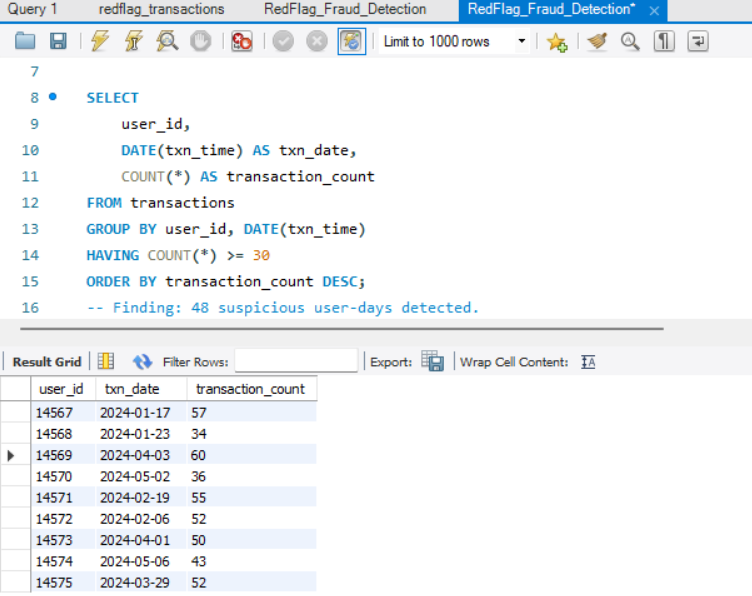
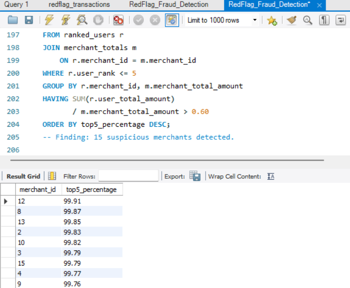
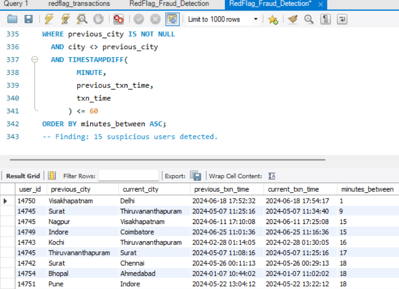

# RedFlag-Fraud-Detection

## SQL-Based Fraud Detection Project

RedFlag is a MySQL-based fraud detection project designed to identify suspicious transaction patterns using pure SQL queries.

## Project Objective

The objective of this project is to analyze transaction data and detect potential fraudulent behavior using rule-based SQL detection techniques.

## Tools & Technologies

- MySQL
- MySQL Workbench
- SQL
- Common Table Expressions (CTEs)
- Window Functions
- Aggregate Functions

## Dataset

The project uses a transaction dataset containing approximately 200,000 transactions across six months.

The transaction table contains the following fields:

- txn_id
- user_id
- merchant_id
- amount
- txn_time
- status
- payment_mode
- city
- txn_type

## Fraud Detection Patterns

The project implements 12 fraud detection patterns:

1. Velocity Fraud
2. Round-Amount Clustering
3. Card Testing
4. Failed-Then-Succeeded
5. Odd-Hour Concentration
6. Mule Accounts
7. Refund Abuse
8. Merchant Collusion
9. Just-Under-Threshold
10. Dormant-Then-Active
11. Velocity Spike
12. Geographic Impossibility

## Detection Results

| Pattern | Suspicious Results |
|---|---:|
| P1 - Velocity Fraud | 48 |
| P2 - Round-Amount Clustering | 25 |
| P3 - Card Testing | 20 |
| P4 - Failed-Then-Succeeded | 25 |
| P5 - Odd-Hour Concentration | 20 |
| P6 - Mule Accounts | 30 |
| P7 - Refund Abuse | 24 |
| P8 - Merchant Collusion | 15 |
| P9 - Just-Under-Threshold | 20 |
| P10 - Dormant-Then-Active | 26 |
| P11 - Velocity Spike | 66 |
| P12 - Geographic Impossibility | 15 |

## Key SQL Concepts Used

- GROUP BY and HAVING
- CASE statements
- Aggregate functions
- Date and time functions
- TIMESTAMPDIFF()
- DATE_FORMAT()
- LAG()
- ROW_NUMBER()
- Common Table Expressions (CTEs)
- Window functions

## Project Screenshots

### P1 - Velocity Fraud

### P8 - Merchant Collusion

### P12 - Geographic Impossibility

## Repository Contents

- `RedFlag_Fraud_Detection.sql` - SQL fraud detection queries
- `P1_Velocity_Fraud.png` - P1 query output
- `P8_Merchant_Collusion.png` - P8 query output
- `P12_Geographic_Impossibility.png` - P12 query output

## Conclusion

RedFlag demonstrates how SQL can be used to identify suspicious transaction behavior through multiple rule-based fraud detection patterns. The project combines aggregation, filtering, date-time analysis, CTEs, and window functions to analyze transaction activity and highlight potentially fraudulent behavior.
